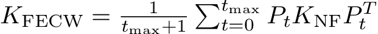
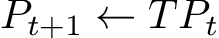

FCW-Kernel
===
This project is a python port of [Coinciding Walk Kernels](https://github.com/rmgarnett/coinciding_walk_kernel) (CWK) [1] and introduces an extension of the model called Feature-CWK (FCWK).
If you want to jump right into some code see the [benchmark](http://nbviewer.ipython.org/github/jonasnick/FCW-Kernel/blob/master/benchmark.ipynb).

CW-Kernels deal with the problem of *node classification* (aka link-based classification) in which a set of features and labels for items are given 
just as in regular classification. In addition, a node classification algorithm accepts a graph of of items and item-item links.
It has been shown that the additional information that is inherent in the network structure improves performance for certain algorithms and datasets.

For CWKs a pair of nodes is similar if random walks starting at each node are similar. 
The advantage of CWKs compared to competing algorithms is twofold.
First, most competing algorithms assume that nodes that are close in graph are likely to have the same label (*homophily*) or even that a node's label is completely determined by its direct neighbors. 
CWKs do not make such an assumption because they are based on the similarity of the local neighborhood structure.
Second, the model is conceptually straightforward and kernels can be easily plugged into existing data science pipelines.

However, CWKs originally do not incorporate any features, therefore classification depends only on the labels of items in the graph, and not on the content.

FCWK
---
The FCW-Kernel naturally extends CWK by including node features.
Instead of comparing two walks based on the visited nodes' labels as in CWK, compare walks based on the similarity of the features of the nodes. 
Note that CWK only takes observed nodes into account, whereas FCWK requires features of *all* nodes and the labels of observed nodes.
In order to achieve that, FCWK takes a feature kernel for the nodes `K_NF` as an additional parameter leading to the following update rule:



where `t_max` is the maximum number of steps in a walk, 
`N` times `n` matrix `P_t` represents
the probability that a random walk that begins at node `i` ends at node `j` after
`t` steps. 
`P_t` is obtained by multiplying prior probabilities with the transition probability `T`, which
is the normalized adjacency matrix:




Benchmark
---
CWKs combined with the simple FCWK adjustment leads to remarkable results compared to state-of-the-art algorithms on standard datasets.
The following table shows the accuracy (in percent) of various classifiers using 3-fold cross validation (see the [benchmark](http://nbviewer.ipython.org/github/jonasnick/FCW-Kernel/blob/master/benchmark.ipynb)). 

|       -       | citeseer      | cora  |
| ------------- |:-------------:| -----:|
| C_prob        | 21.1          | 30.2  |
| content only  | 68.6      | 70.7 |
| RL            | 72.7      | 82.1 |
| LBP           | 72.9      | 84.5 |
| CWK           | 71.4      | 86.2 |
| FCWK          | 76.6      | 87.1 |

Citeseer and cora datasets were obtained from the [LINQS group](http://linqs.cs.umd.edu/projects//projects/lbc/index.html) [3].
C_prob is a classifier that simply picks the most frequent label.
The results of content only, Relaxation Labeling (RL), Loopy Belief Propagation (LBP) stem from [2].
The kernel used in CWK and FCWK is a linear bag of words kernel (t_max = 10).

Computing CWK for the citeseer dataset (3312 nodes and 4732 links, 1:2 train/test split) took 1.2 seconds and
computing FCWK (given a node-kernel) took 60 seconds on a 3.0 ghz core.
CWK is in `O(t_max*k*n^2)` where `k` is the number of classes, and naive FCWK is in `O(t_max*n^3)`.
However, their performance is very good for small datasets because P_t and T are treated as sparse matrices.

 
Requirements:
---
```
python 2.7
numpy
scipy
```

for the example
```
scikit-learn
```


Install
---
`python setup.py install`

Example and Benchmark
---
See the [benchmark](http://nbviewer.ipython.org/github/jonasnick/FCW-Kernel/blob/master/benchmark.ipynb) as an example.
If you want to run the benchmark yourself, run `configure` first to download the datasets.

Tests
---
Also, after running `configure` you can invoke the tests which show that CWK is indeed a correct port of the original version. 

`python test/CWKernelTest.py`

TODO
---
* check multicore feature
* check accuracy on sparse datasets
* implement wrapper to have proper classifier for scikit-learn

References
---
```
[0] https://github.com/rmgarnett/coinciding_walk_kernel

[1] @inproceedings{neumann2013coinciding,
  title={Coinciding Walk Kernels: Parallel Absorbing Random Walks for Learning with Graphs and Few Labels},
  author={Neumann, Marion and Garnett, Roman and Kersting, Kristian},
  booktitle={Asian Conference on Machine Learning},
  pages={357--372},
  year={2013}
}
[2] @inproceedings{lu2003link,
  title={Link-based classification},
  author={Lu, Qing and Getoor, Lise},
  booktitle={ICML},
  volume={3},
  pages={496--503},
  year={2003}
}

[3] @article{sen2008collective,
  title={Collective classification in network data},
  author={Sen, Prithviraj and Namata, Galileo and Bilgic, Mustafa and Getoor, Lise and Galligher, Brian and Eliassi-Rad, Tina},
  journal={AI magazine},
  volume={29},
  number={3},
  pages={93},
  year={2008}
}
```
 

